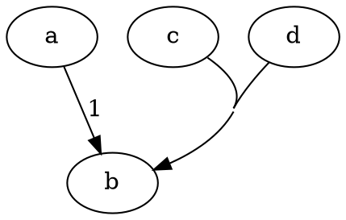

## about

salt is a tool which acts as a simple interface for your project. You let the
users know what your project can do for them.

## commands

- b - `cargo build` - builds salt binary
- i - `cp target/debug/salt /usr/local/bin/s` - installs the salt binary
- r - `cargo run` - runs the salt binary
- c - `cargo clippy` - runs clippy command for salt binary
- release - `./release.sh` - creates a release package

## options

- type - project
- name - bin

## help

this project is the for salt interface

<!-- documentation starts here -->

### Quickstart

#### Why 🧂

`salt` drastically reduces **_context-switching_** for developers and helps them
focus on the task. This tool provides all the convienience automating of
repeating tasks.

#### Installing salt binary

> Install `salt` bundler

```sh
sh https://github.com/codekidx/salt/salt.sh
```

### Use Cases

#### Use cases of salt bundler

- Quickly create a CLI with 2 commands `s init` and `s pin`
- Importing scripts from anywhere. If your git repository has `salt.md` it is
- Can be used as a tooling framework for your project/organization.
- Cross-team tooling and collaboration
- Reduce directory/context switching
- Seamless updates of your bundle through `s update`

### Intrinsics

#### Salt Commands

- `init` - inits a new `salt.json` file in the current directory with example
  command
- `add` - adds a bundle to your salt interface
- `pin` - pinning the folder as a salt project
- `unpin` - unpin a salt project
- `open` - open a project in your default file manager
- `jump` - jump to the project folder
- `+ {BUNDLE} {COMMAND...}` - wildcard command to run any command on a pinned project
- `-` - runs the last salt command

### Creating a new bundle

A new salt project can be initialized with the following command.

```sh
s init
```

### Pinning Existing Project

#### Pinning

You can create `SALT.md` in any folder and use it as a salt project using the `pin` command

```sh
s pin
```

#### Unpinning

Pinned project can be unpinned with the following command

```sh
s unpin
```

### Jumping to a project folder

To switch between project efficiently salt has the `jump | j` command which can
be used with `cd` command to jump to the bundle directory.

```sh
cd $(s j {project})
```

where `{project}` is the name of your project which is given inside `#options.name` option inside `SALT.md`.

### Local Docs

#### Write concise documentation

`SALT.md` file serves as an interface to your projects, it can tell you more
about the project than the code written, if used it wisely.

```
### This is a section
```

```
#### This is a heading inside the section
```

To give you an example from this doc itself:

> you can see that here `Local Docs` is a section and
> `Write concise documentation` is a heading inside this section.

### Editing projects

#### From anywhere

You can use the `edit` or `e` command to open any pinned salt project from any
location through your terminal.

You can go to `~/.salt/.config` to set your favourite editor there.

> **Default:** `vi` (vi editor)

```
{
    "editor": "code", // changed it to VS Code
    "pinned_paths": {}
}
```

### Opening file explorer

#### From anywhere

You can use the `open` or `o` command to open your default OS file manager
pointed to the salt project. Example:

```
s o PROJECT/BUNDLE
```

### Bundles

A Bundle is a collection of salt projects.

### Contributing

#### Interface Flow

There is a internal flow which is executed whenever you invoke the `salt` command.

We use the `markdown` crate to tokenize the `SALT.md` file. Once the tokenization is done, we get a list of `Block` which are collection of markdown blocks.

The salt parser is capable of converting the `Vec<markdown::Block>` into what's called a `salt::ProjectDefinition`. The `salt::ProjectDefinition` is internal representation of Salt Project in Markdown form. Hence the name, `salt::ProjectDefinition`.

#### Doc Flow

If you want commands to be run through the CLI `salt::ProjectDefinition` is the final representation. But if you want to view your project as a document, the `salt::ProjectDefinition` is converted into `salt::Doc`. This is where `markdown::Blocks` are converted to proper HTML representation of themselves.

The custom parsing helps us to create `salt::Doc` which is then passed to `salt.hbs` which is the salt doc template, and final HTML is rendered by handlebars templating engine.

### Dot Diagrams

#### Drawing Graphs

Salt supports [Graphviz](https://graphviz.gitlab.io) diagrams which can be used to embed diagrams. The below graph:



can be represented using the following code:

```
digraph {
    concentrate=true
    a -> b [label="1"]
    c -> b
    d -> b
}
```

To learn more, checkout [Graphviz documentation](https://graphviz.gitlab.io/documentation/).
